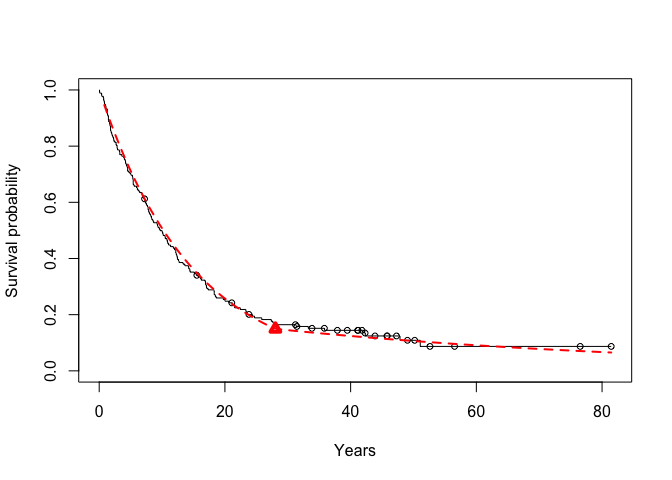
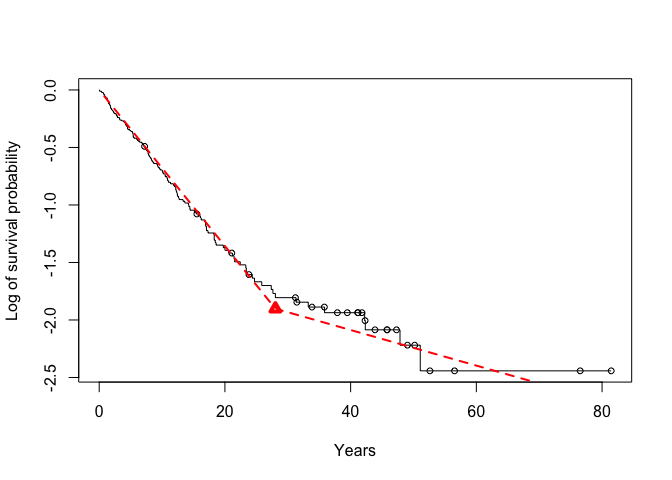
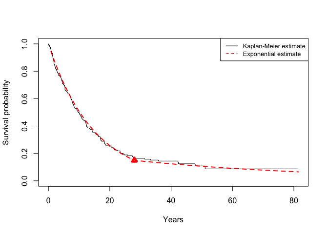

<!-- README.md is generated from README.Rmd. Please edit that file -->
RPEXE.RPEXT
===========

This reduced piecewise exponential survival software implements the likelihood ratio test procedure in Han, Schell, and Kim (2012[1], 2014[2]), and Han et al. (2016[3]). Inputs to the program can be either times when events/censoring occur or the vectors of total time on test and the number of events. Outputs of the programs are times of events and the corresponding p- values. The order of times and p-values is determined by a backward elimination procedure. Details about the model and implementation are given in Han et al. 2014. Adelson (2016[4]) also mentioned the application of the method. This program can run in R version 3.2.2 and above.

Installation
------------

You can install RPEXE.RPEXT from github with:

``` r
# install.packages("devtools")
devtools::install_github("/RPEXE.RPEXT")
```

Example
-------

This is a basic example which shows you how to solve a common problem:

``` r
require(RPEXE.RPEXT)
#> Loading required package: RPEXE.RPEXT
library(RPEXE.RPEXT)

# load in the data2 dataset
data(simple)
times = simple[,2]
cens  = simple[,1]
result = RPEXEv1_2(times,cens,monotone = 3,criticalp = 0.05)
#> [1] "last"
#> [1] 9
```



Some more examples can be found in demos and vignettes of the package.

[1] Han, G., Schell, M. J., and Kim, J. (2012) “Comparing Two Exponential Distributions Using the Exact Likelihood Ratio Test," Statistics in Biopharmaceutical Research, 4(4), 348-356.

[2] Han, G., Schell, M. J., and Kim, J. (2014) “Improved Survival Modeling in Cancer Research Using a Reduced Piecewise Exponential Approach," Statistics in Medicine, 33(1), 59-73.

[3] Han, G., Schell, M., Zhang, H., Zelterman, D., Pusztai, L., Adelson, K., and Hatzis, C. (2016) “Testing Violations of the Exponential Assumption in Cancer Clinical Trials with Survival Endpoints," Biometrics, DOI: 10.1111/biom.12590; PMID: 27669414.

[4] Adelson, K. B., Ramaswamy, B., Sparano, J. A., Christos, P. J., Wright, J. J., Raptis, G., Han, G., Villalona-Calero, M., Ma, C., Hershman, D., Baar, J., Klein, P., Cigler, T., Budd, T., Novik, Y., Tan, A.R., Tannenbaum, S., Goel, A., Levine, E., Shapiro, C. L., Andreopoulou, E., Naughton, M., Kalinsky, K., Waxman, S., Germain, D. (2016) “Randomized Phase II Trial of Fulvestrant Alone or in Combination with Bortezomib in Hormone Receptor-Positive Metastatic Breast Cancer Resistant to Aromatase Inhibitors: A New York Cancer Consortium Trial," Nature Partner Journals Breast Cancer, Volume 2, Article ID 16037, DOI: 10.1038/npjbcancer.2016.37.
